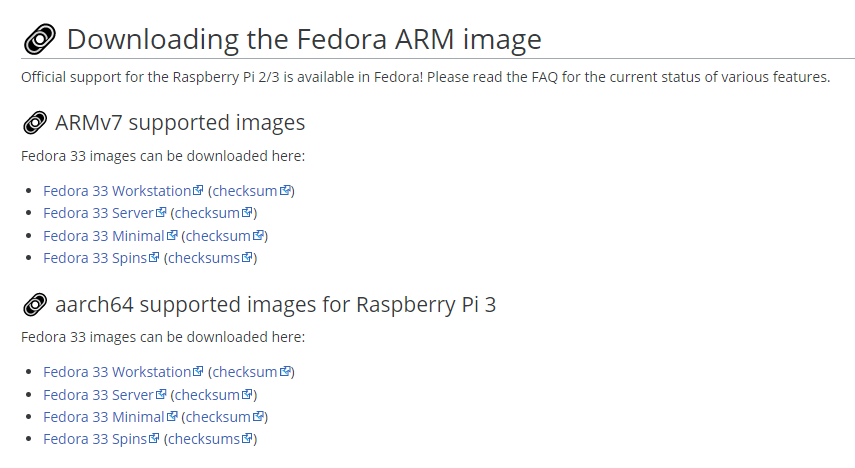

Fedora를 설치해서 사용해보려고 Hyper-V 설치하고 하다가 문득 집에 RPi3+가 남아서  
여기에 설치를 해보자 싶어서 시작.

라즈베리파이 사용할 때 주로 그냥 라즈비안 올려서 사용했었는데 페도라를 올리면 또  
다른 느낌일 것 같아서 급하게 자료 찾아보고 설치를 진행했다.

우선 다행이도 [Fedora WiKi](https://fedoraproject.org/wiki/Architectures/ARM/Raspberry_Pi#aarch64_supported_images_for_Raspberry_Pi_3)에 라즈베리파이 설치 관련 문서가 있었고  
영어의 압박만 견디면 따라하기 나름 쉽게 정리되어있다.

해당 문서 내용 중에 라즈베리파이용 페도라 이미지가 있으니 다운 받아서 설치만  
해주면 된다.

ARMv7용과 aarch64용(RPi3용)으로 구분되어있으니 본인 환경에 맞게  
다운 받으면 된다.  
이미지는 구했고 이미지를 SD Card에 구워야하는데 Windows 환경에서 진행하였기  
때문에 자주 사용했던 [balenaEtcher](https://www.balena.io/etcher/)를 사용하였다.

리눅스 환경에서 진행하는 방법은 위키에 자세히 잘 설명되어있으니  
참고하면 될 것 같다.

이미지가 성공적으로 구워졌으면 이제 라즈베리파이에 SD카드 옮겨 꽂고 부팅만 하면  
끝!

처음에 어려울거라 생각하고 포스팅도 같이 준비한건데 위키가 생각보다  
잘 정리되어있고 페도라가 라즈베리파이를 잘 지원해줘서 특별히 따로 정리할 게  
없는 것 같다..